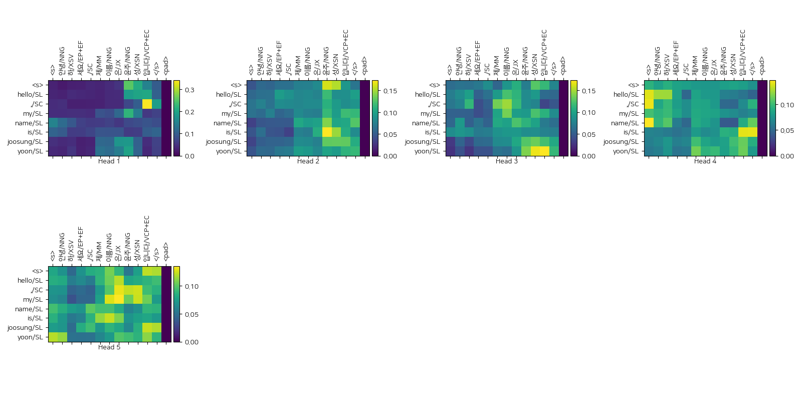

# Attention is All You Need
TensorFlow 2.0 style Transformer implementation   (with mecab tokenzier)

### Result

```
Input: 안녕하세요, 제 이름은 윤주성입니다
Predicted translation: [['<s>', 'hello/SL', ',/SC', 'my/SL', 'name/SL', 'is/SL', 'joosung/SL', 'yoon/SL']]
```




#### Number of params of simple transformer 
```bash
Layer (type)                 Output Shape              Param #   
=================================================================
EncoderLayer (EncoderLayer)  multiple                  53800     
_________________________________________________________________
DecoderLayer (DecoderLayer)  multiple                  84300     
_________________________________________________________________
dense_13 (Dense)             multiple                  2929      
_________________________________________________________________
softmax (Softmax)            multiple                  0         
=================================================================
Total params: 141,029
Trainable params: 141,029
Non-trainable params: 0
_________________________________________________________________

```

### ToDo
- Beam search
- Label Smoothing
- Layer Structure (Should be modified)


### Future Work
- BERT
- GPT2

### Reference Repositories
- [TF 2.0 Style Transformer](https://colab.research.google.com/github/tensorflow/docs/blob/master/site/en/r2/tutorials/text/transformer.ipynb)
- [The Annotated Transformer](http://nlp.seas.harvard.edu/2018/04/03/attention.html)
